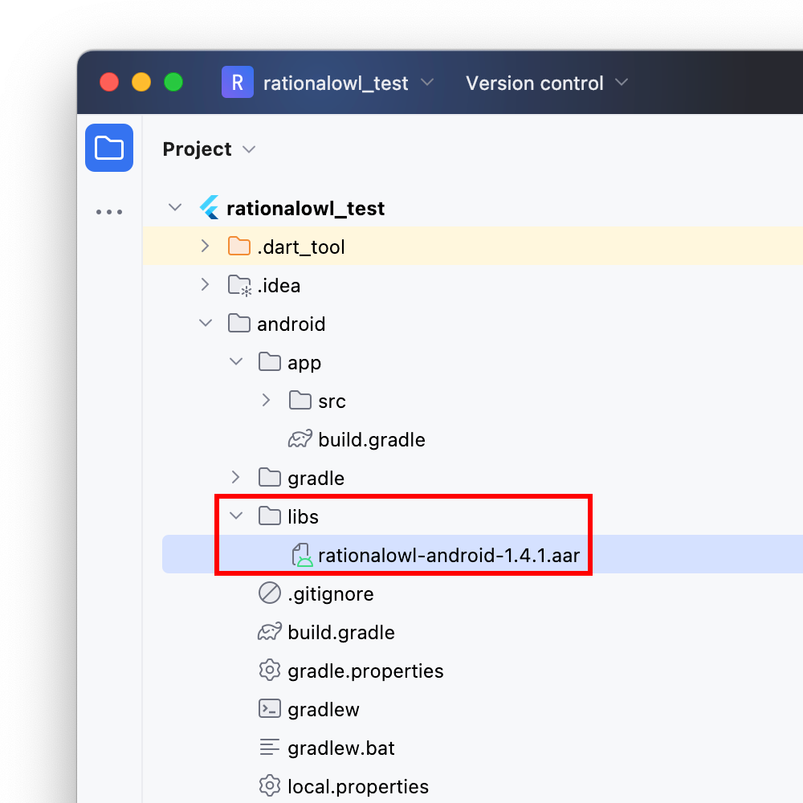
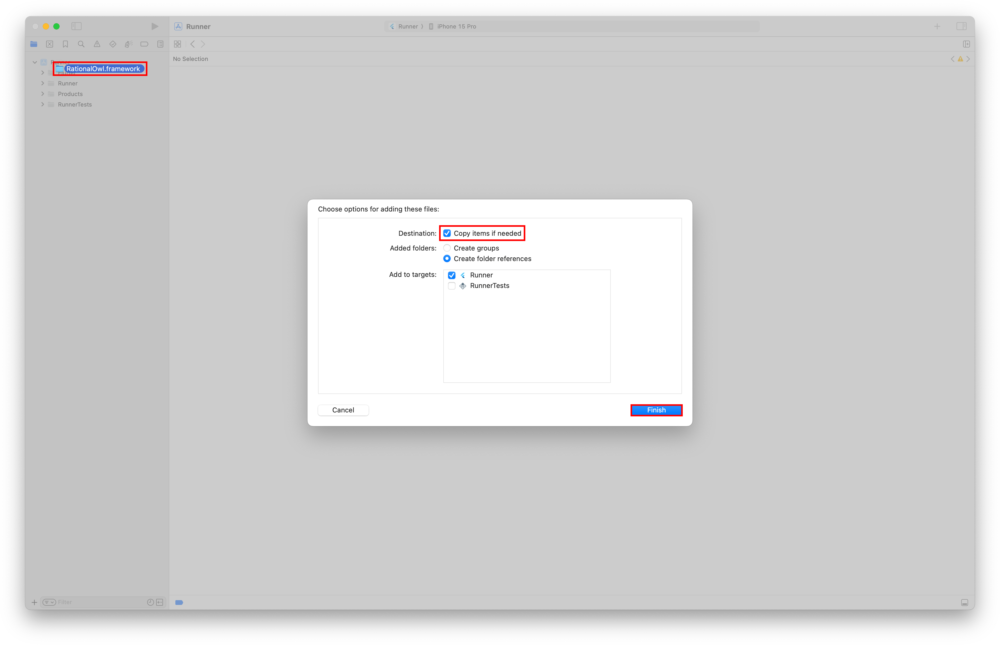
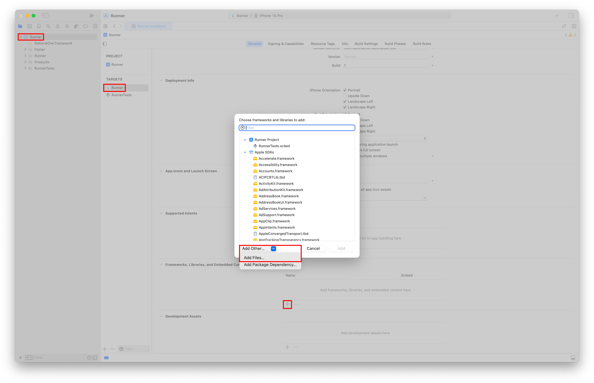
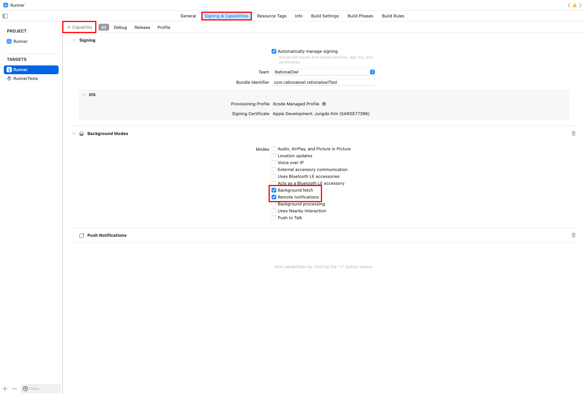
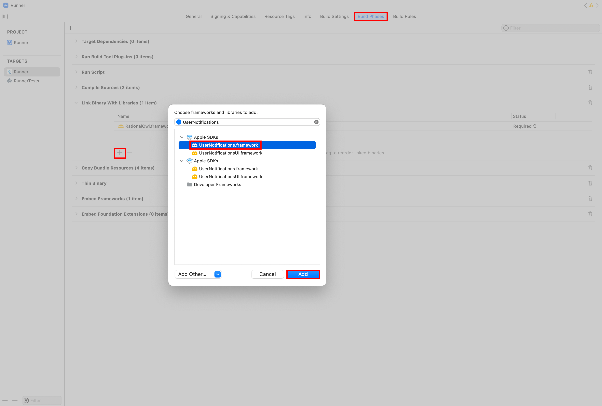
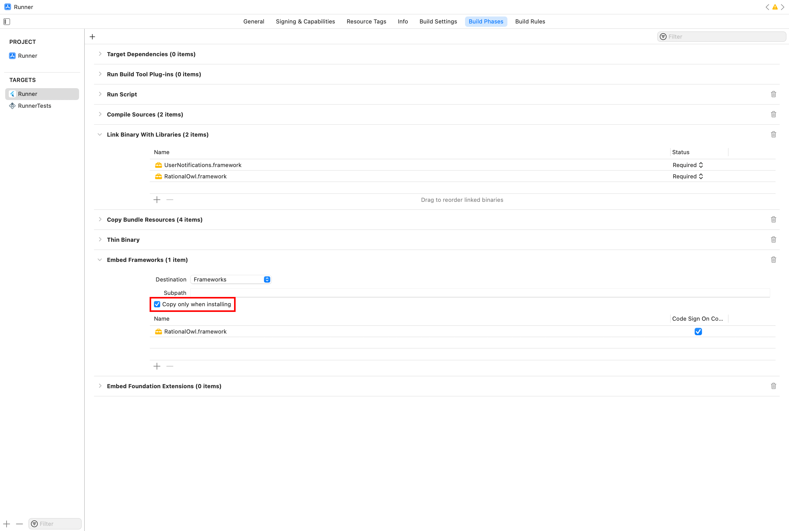
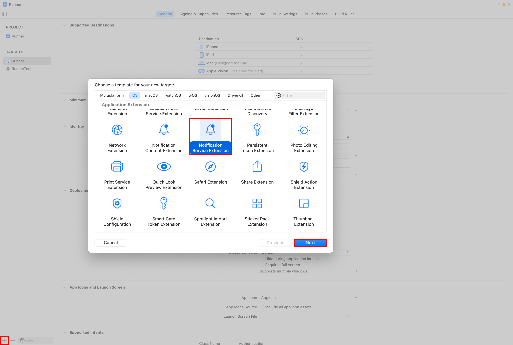
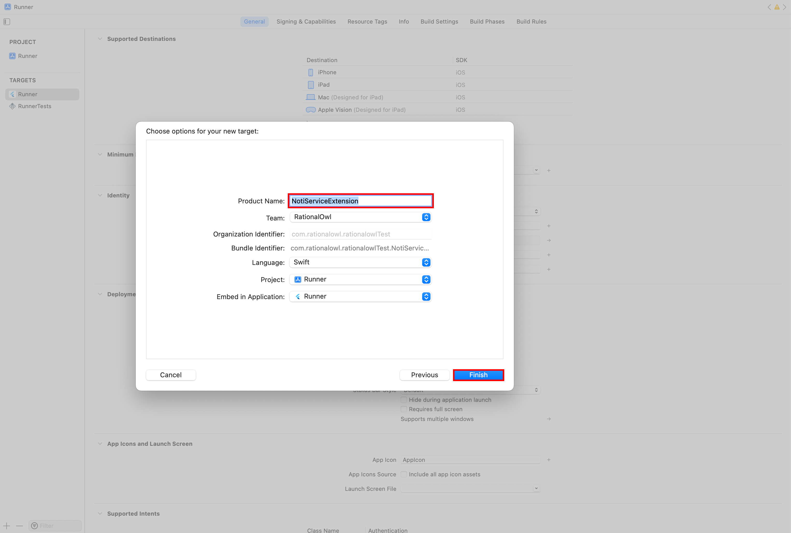

# RationalOwl Plugin for Flutter

[](https://pub.dev/packages/rationalowl_flutter)

A Flutter plugin to use the [RationalOwl API](https://www.rationalowl.com).

## Usage

To use this plugin, add `rationalowl_flutter` as a [dependency in your pubspec.yaml file](https://flutter.dev/docs/development/platform-integration/platform-channels).

## Getting Started

* Integrate the Firebase Cloud Messaging (FCM) and Apple Push Notification service (APNs) in your RationalOwl service.
  * [FCM Integration](https://github.com/RationalOwl/rationalowl-guide/blob/master/device-app/fcm-setting/README.md)
  * [APNs Integration using .p8 Certificate (recommended)](https://github.com/RationalOwl/rationalowl-guide/tree/master/device-app/ios-apns-p8)
  * [APNs Integration using .p12 Certificate](https://github.com/RationalOwl/rationalowl-guide/tree/master/device-app/ios-apns-p12)

### Android

1. Download the [rationalowl-android-1.4.1.aar](https://github.com/RationalOwl/rationalowl_flutter/tree/main/example/android/app/libs) file.

2. Create the `libs` directory in `android/app`, then copy the `rationalowl-android-1.4.1.aar` file.



3. Set the `dependencies` in `android/app/build.gradle`:

```groovy
dependencies {
    implementation fileTree(include: ['*.jar'], dir: 'libs')
    implementation files('libs/rationalowl-android-1.4.1.aar')
}
```

4. Use [Firebase Messaging](https://pub.dev/packages/firebase_messaging) for background messages.

### iOS

1. Open your project workspace file `ios/Runner.xcworkspace` via Xcode.

2. Download the [RationalOwl.framework](https://github.com/RationalOwl/rationalowl_flutter/tree/main/example/ios) directory.

3. Drag and drop the `RationalOwl.framework` directory to the `Runner` project.

4. Select the `Copy items if needed` checkbox, then click `Finish`.



5. Select the `Runner` project, then select the `Runner` target.

6. Open the `Frameworks, Libraries, and Embedded Content` section, then click on the `+` button.

7. Click the `Add Files...` menu item, then choose the `RationalOwl.framework` directory.



8. Select the `Signing & Capabilities` tab, then click on the `+ Capability` button.

9. Add the `Push Notifications` and `Background Modes` capabilities.

10. In the `Background Modes` capability, enable the `Background fetch` and `Remote notifications` modes.



11. Select the `Build Phases` tab, then open the `Link Binary With Libraries` section.

12. Click on the `+` button.

13. Choose the `UserNotifications.framework`, then click `Add`.



14. Open the `Embed Frameworks` section, then select the `Copy only when installing` checkbox.



15. Click on the `+` button on the left bottom.

16. Choose the `Notification Service Extension` template, then click `Next`.



17. Add the `Product Name`, then click `Finish`.



### Sample Usage

```dart
const iOSAppGroup = 'group.com.rationalowl.flutterexample';

Future<void> _initialize() async {
  if (Platform.isAndroid) {
    await Firebase.initializeApp(options: DefaultFirebaseOptions.currentPlatform);
    FirebaseMessaging.onBackgroundMessage(handleMessage);
  }

  await initializeNotification();

  final MinervaManager minMgr = MinervaManager.getInstance();

  if (Platform.isIOS) {
    await minMgr.setAppGroup(iOSAppGroup);
  }

  await minMgr.setMsgListener(RoMessageListener());
}

void main() async {
  WidgetsFlutterBinding.ensureInitialized();
  await _initialize();

  runApp(const Application());
}

class Application extends StatefulWidget {
  const Application({super.key});

  @override
  State<StatefulWidget> createState() => _ApplicationState();
}

class _ApplicationState extends State<Application> with WidgetsBindingObserver {
  late final MinervaAppLifecycleObserver _observer;

  @override
  void initState() {
    super.initState();

    if (Platform.isIOS) {
      _observer = MinervaAppLifecycleObserver();
      WidgetsBinding.instance.addObserver(_observer);
    } else {
      FirebaseMessaging.instance.onTokenRefresh.listen(handleTokenRefresh);
    }
  }

  @override
  void dispose() {
    if (Platform.isIOS) {
      WidgetsBinding.instance.removeObserver(_observer);
    }

    super.dispose();
  }

  @override
  Widget build(BuildContext context) {
    return const MaterialApp(
      home: Scaffold(
        body: SafeArea(
          child: MainPage(),
        ),
      ),
    );
  }
}
```

In your Dart code, implement the `MessageListener` to receive foreground messages in Android and iOS.
```dart
class RoMessageListener implements MessageListener {
  @override
  void onDownstreamMsgReceived(List<Map<String, dynamic>> msgList) {}

  @override
  void onP2PMsgReceived(List<Map<String, dynamic>> msgList) {
    if (msgList.isNotEmpty) {
      final latestMessage = Map<String, dynamic>.from(msgList[0]['data']);
      showNotification(latestMessage);
    }
  }

  @override
  void onPushMsgReceived(List<Map<String, dynamic>> msgList) {
    if (msgList.isNotEmpty) {
      final latestMessage = Map<String, dynamic>.from(msgList[0]['data']);
      showNotification(latestMessage);
    }
  }

  @override
  void onSendUpstreamMsgResult(int resultCode, String? resultMsg, String? msgId) {}

  @override
  void onSendP2PMsgResult(int resultCode, String? resultMsg, String? msgId) {}
}
```

In your Dart code, implement the handlers to receive the token and background messages in Android.
```dart
Future<void> handleTokenRefresh(String token) async {
  final MinervaManager minMgr = MinervaManager.getInstance();
  minMgr.setDeviceToken(token);
}

@pragma('vm:entry-point')
Future<void> handleMessage(RemoteMessage message) async {
  final Map<String, dynamic> data = message.data;

  final MinervaManager minMgr = MinervaManager.getInstance();
  minMgr.enableNotificationTracking(data: data);

  if (!data.containsKey('silent')) {
    showNotification(data);
  }
}
```

In your Swift code `ios/{Product Name}/NotificationService.swift`, implement the `UNNotificationServiceExtension` to receive background messages in iOS.
```swift
class NotificationService: UNNotificationServiceExtension {
    private static let appGroup = "group.com.rationalowl.flutterexample"

    var contentHandler: ((UNNotificationContent) -> Void)?
    var bestAttemptContent: UNMutableNotificationContent?

    override func didReceive(_ request: UNNotificationRequest,
                             withContentHandler contentHandler: @escaping (UNNotificationContent) -> Void) {
        self.contentHandler = contentHandler
        bestAttemptContent = (request.content.mutableCopy() as? UNMutableNotificationContent)
        
        if let bestAttemptContent = bestAttemptContent {
            let userInfo = bestAttemptContent.userInfo

            let minMgr = MinervaManager.getInstance()!
            minMgr.enableNotificationTracking(userInfo, appGroup: Self.appGroup)

            if userInfo["notiTitle"] != nil {
                bestAttemptContent.title = userInfo["notiTitle"] as! String
            }
            if userInfo["notiBody"] != nil {
                bestAttemptContent.body = userInfo["notiBody"] as! String
            }

            contentHandler(bestAttemptContent)
        }
    }
    
    override func serviceExtensionTimeWillExpire() {
        if let contentHandler = contentHandler, let bestAttemptContent = bestAttemptContent {
            contentHandler(bestAttemptContent)
        }
    }
}
```

See the [example](https://github.com/RationalOwl/rationalowl_flutter/tree/main/example) directory for a complete sample app.
